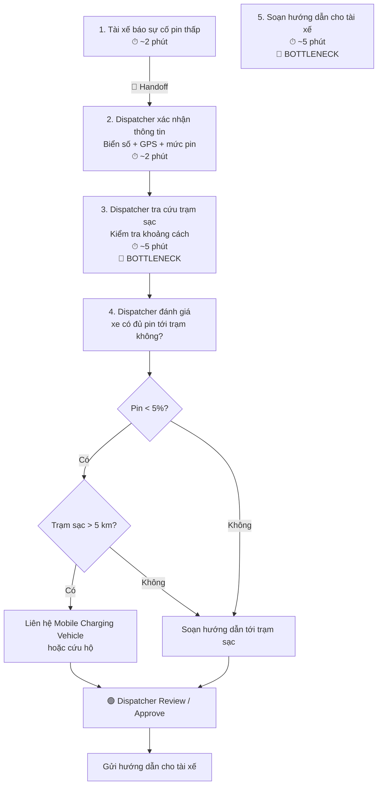

# 04 — Workflow Diagram
## Xanh SM: Điều phối sự cố pin thấp

### Current-State Workflow



---

## Workflow Description

### Step 1 — Driver reports battery issue

Tài xế thông báo xe đang gặp tình trạng pin thấp hoặc sắp hết pin.

Thông tin cần cung cấp:

- Biển số xe
- Vị trí GPS
- Mức pin hiện tại

Thời gian giả định:

```text
~2 phút
```

---

### Step 2 — Dispatcher validates information

Dispatcher kiểm tra:

- thông tin xe;
- vị trí;
- mức pin;
- tình trạng hiện tại của tài xế.

Thời gian giả định:

```text
~2 phút
```

---

### Step 3 — Charging station lookup

Dispatcher tìm:

- trạm sạc gần nhất;
- khoảng cách;
- khả năng tiếp cận;
- trạng thái trạm sạc.

Đây là một trong những bottleneck chính.

Thời gian giả định:

```text
~5 phút
```

---

### Step 4 — Safety Decision

Dispatcher kiểm tra mức pin.

Rule:

```text
battery < 5%
```

Nếu pin dưới 5%, hệ thống phải tiếp tục kiểm tra khoảng cách tới trạm.

---

### Step 5 — Critical Battery Decision

Nếu:

```text
battery < 5%
```

và:

```text
station_distance > 5 km
```

thì không được hướng dẫn tài xế tới trạm đó.

Phương án:

```text
dispatch_mobile_charger
```

hoặc chuyển sang cứu hộ.

---

### Step 6 — Draft Driver Guidance

Nếu xe đủ điều kiện an toàn để tới trạm, hệ thống có thể tạo hướng dẫn.

Mọi nội dung phải bắt đầu bằng:

```text
[DRAFT_ONLY]
```

Ví dụ:

```text
[DRAFT_ONLY] Trạm sạc phù hợp gần nhất cách vị trí hiện tại khoảng 3 km.
Vui lòng chờ Dispatcher xác nhận trước khi di chuyển.
```

---

### Step 7 — Human Review

Dispatcher kiểm tra:

- vị trí;
- mức pin;
- khoảng cách;
- nội dung AI tạo;
- safety rules.

AI không được tự gửi tin cho tài xế.

---

### Step 8 — Approved Action

Sau khi Dispatcher approve:

```text
Draft
  ↓
Human Review
  ↓
Approved
  ↓
Send to Driver
```

---

# Bottlenecks

Hai bottleneck chính:

```text
1. Tra cứu trạm sạc và khoảng cách

2. Soạn nội dung xử lý cho tài xế
```

Thời gian giả định:

```text
Tra cứu trạm: ~5 phút

Soạn hướng dẫn: ~5 phút
```

---

# Handoff

Handoff chính:

```text
Driver
  ↓
Dispatcher
  ↓
Charging Station / Location Data
  ↓
Dispatcher
  ↓
Driver / Mobile Charging Team
```

---

# Current-State Estimated Processing Time

```text
Nhận sự cố             ~2 phút
Xác nhận thông tin     ~2 phút
Tra cứu trạm           ~5 phút
Soạn hướng dẫn         ~5 phút
Quyết định xử lý       ~1 phút
--------------------------------
Tổng                   ~15 phút
```

> Các số liệu trên là giả định phục vụ bài Lab và cần được xác minh bằng dữ liệu vận hành thực tế.

---

# Future Improvement

Future-State có thể bổ sung AI:

```text
Driver Incident
      ↓
Auto Collect GPS + Battery
      ↓
Rule-Based Safety Check
      ↓
LLM Draft
      ↓
[DRAFT_ONLY]
      ↓
Human Review
      ↓
Approved Action
```

Mục tiêu:

```text
Current-State: ~15 phút

Future-State Target: < 3 phút
```

AI chỉ hỗ trợ:

```text
Analyze
Suggest
Draft
```

Dispatcher vẫn chịu trách nhiệm:

```text
Review
Approve
Execute
```